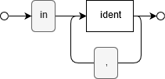
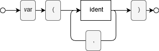
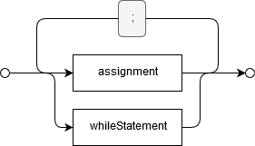
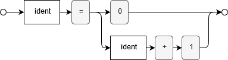

# Praktikum 1

## Aufgabe 1

Program


Input Variables



Output Variables


Variables



Statements



Assignment



While Statement


Condition


## Aufgabe 2

While0 statement:

```
while V1 != V2 do begin α end
```

URM equivalent:

```
1: SUB(R1,R2,R3)
2: SUB(R2,R1,R4)
3: if R3 != 0 goto 5
4: if R4 == 0 goto 6
5: α
6: 
```